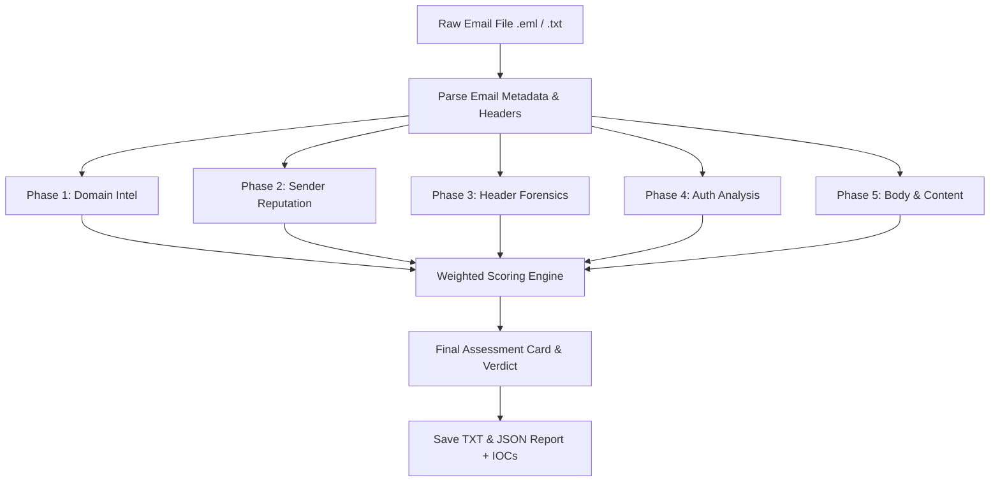

# SOC Mail Spoof & Phishing Analysis Tool (v2.0)

Welcome to the new, modular, and highly comprehensive email analysis tool designed specifically for Security Operations Center (SOC) analysts. This tool replaces the basic single-file script with an end-to-end, multi-phased forensics engine capable of detecting sophisticated spoofing and phishing attempts with high confidence.

## Architecture & Module Directory

The tool is organized into modular Python files under the `MailSpoofAnalysis` repository:

- **`config.py`**: Central settings, API keys (VirusTotal, AbuseIPDB), thresholds, weighted scoring configurations, blocklists, and detection keyword databases.
- **`main.py`**: The main orchestrator and Command-Line Interface (CLI).
- **`analyzer/`**:
  - **`domain_intel.py`**: Domain age (WHOIS), punycode, Unicode homoglyph mixed-script detection, and DNS verification (A, MX, SPF, DMARC presence).
  - **`sender_reputation.py`**: Originating IP extraction, geo-IP resolution, AbuseIPDB checking, reverse DNS (PTR record alignment), and VirusTotal IP reputation.
  - **`header_forensics.py`**: Hop tracing (Received chain), timestamp chronologue/future checks, header anomaly/injection checks, X-Mailer validation.
  - **`auth_analysis.py`**: SPF/DKIM/DMARC/ARC authentication results parsing and RFC alignment checking.
  - **`body_analysis.py`**: Plain text/HTML parsing, URL extraction, hyperlink/display URL mismatch detection, attachment extension/hash verification, and keyword heuristics.
  - **`scoring_engine.py`**: Weighted logic normalization and verdict engine.
  - **`report_generator.py`**: Pretty console output tables (using `rich`) and formatted text + JSON report savers.

---

## 🔍 The 5 Forensic Analysis Phases



### Phase 1: Domain Intelligence (`domain_intel.py`)
- **WHOIS Domain Age**: Flags domains created in the last 30 or 90 days.
- **Punycode/IDN Validation**: Normalizes domains and flags homoglyphs (e.g., Cyrillic characters mimicking Latin letters).
- **DNS Verification**: Verifies if the sending domain actually has valid `A` or `MX` records.
- **SPF/DMARC Record Verification**: Verifies presence of published policies.

### Phase 2: Sender Reputation (`sender_reputation.py`)
- **Originating IP Extraction**: Parses the Received chain from bottom to top to identify the initial public sending IP.
- **GeoIP Lookup**: Locates the country and ISP of the sending mail relay.
- **Threat Intelligence Feeds**: Queries AbuseIPDB and VirusTotal to check for reported malicious activity.
- **DNS Blocklists**: Cross-checks the sending IP against Spamhaus, Barracuda, Spamcop, and other lists.
- **Reverse DNS Validation**: Checks if the PTR record matches the claimed domain.

### Phase 3: Header Forensics (`header_forensics.py`)
- **Received Hop Tracing**: Maps the chain of transit servers.
- **Chronological Timestamp Analysis**: Validates that all timestamps in the Received headers flow logically forwards in time and flags future dates.
- **Domain Alignment Comparison**: Checks for discrepancies between `From`, `Return-Path`, `Reply-To`, and `Envelope-From` headers.
- **Header Injection Checks**: Scans for duplicated critical headers.

### Phase 4: Authentication Deep Analysis (`auth_analysis.py`)
- **SPF alignment**: Checks if the SPF domain aligns with the Header From domain.
- **DKIM verification & alignment**: Validates if the DKIM signature domain (`d=`) matches the Header From domain.
- **DMARC policy enforcement**: Highlights DMARC failures and flags if the receiver accepted an email in violation of the sender's DMARC `reject` policy.

### Phase 5: Body & Content Analysis (`body_analysis.py`)
- **Hyperlink Destination Verification**: Compares the visible text of hyperlinks in HTML email against their actual destination `href`.
- **IP-based URLs & Shorteners**: Flags URLs containing raw IP addresses or shortened domains.
- **Attachment Analysis**: Flags suspicious double extensions (e.g., `.pdf.exe`) and queries VirusTotal with the file hash.
- **Phishing Heuristics**: Evaluates occurrences of threat/urgency keywords, script tags, embedded HTML forms, and password inputs.

---

## 📊 Weighted Risk Scoring Engine

Each finding generates a threat severity (INFO, LOW, MEDIUM, HIGH, CRITICAL).
The score card applies category weights normalized to prevent a single flag from falsely skewing a verdict:

| Forensic Category | Max Score |
| :--- | :---: |
| Authentication (SPF/DKIM/DMARC/ARC) | 30 |
| Domain Intelligence | 20 |
| Header Forensics | 20 |
| Sender Reputation | 15 |
| Body & Content Analysis | 15 |
| **Total** | **100** |

### Verdict Thresholds
- **0 - 15**: `LEGITIMATE` (Green)
- **16 - 40**: `SUSPICIOUS` (Yellow)
- **41 - 70**: `LIKELY PHISHING` (Orange)
- **71 - 100**: `CONFIRMED SPOOFED/MALICIOUS` (Red)

---

## 🚀 How to Run

1. **Configure API Keys** (Optional, but highly recommended for threat reputation lookups):
   Open `config.py` and insert your API keys, or export them as environment variables:
   ```cmd
   set VIRUSTOTAL_API_KEY=your_key_here
   set AUSEIPDB_API_KEY=your_key_here
   ```

2. **Execute the analysis**:
   ```cmd
   python main.py sample_emails\phishing_sample.eml
   ```
   Or run without arguments to start the interactive file path prompt.

3. **View reports**:
   Detailed analysis logs, recommendations, and extracted Indicators of Compromise (IOCs) are saved automatically in both text format (`reports/email_analysis_*.txt`) and machine-readable JSON format (`reports/email_analysis_*.json`) for easy ingestion into SIEM or SOAR systems.
